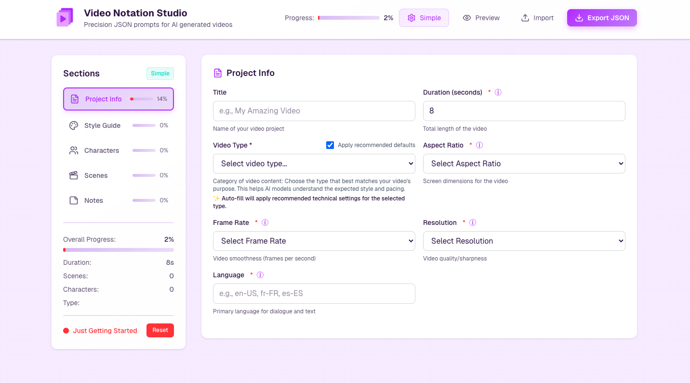

# Video Notation Schema
*Precision JSON prompts for AI‑generated video content*


---

## About

The **Video Notation Schema** is a comprehensive JSON Schema (Draft 2020‑12) that defines a structured prompt format for programmatic video creation with Artificial Intelligence (A.I.) models. It enables creators, prompt engineers, and developers to articulate their creative intent with exceptional precision, from global video attributes to shot‑by‑shot instructions, character profiles, camera controls, audio elements, and reusable components such as props, subjects, motion graphics, lighting, and tone presets.

Current release | **v1.0.0**
Schema URI    | `https://schemas.video-notation.com/video-notation.schema@v1.0.0`

---

## ✨ Key Features

| Area                       | Highlights                                                                                                         |
| -------------------------- | ------------------------------------------------------------------------------------------------------------------ |
| **Detailed metadata**      | Duration, aspect ratio, resolution, language, target audience, accessibility flags, etc.                           |
| **Character definitions**  | Rich, reusable character profiles with wardrobe, personality, and vocal traits.                                    |
| **Global styling**         | Consistent visual and auditory themes (camera, lighting, tone, audio) across the entire video.                     |
| **Scene‑by‑scene control** | Unique parameters for each scene, including location, environment, subjects, props, motion graphics, and dialogue. |
| **Reusable assets**        | Define global props, audio elements, subjects, motion graphics, and lighting/tone presets for efficient prompting. |
| **Cinematic parameters**   | Granular control over camera angles, motion, framing, focus, lighting, and colour grading.                         |
| **Accessibility**          | Metadata for captions, audio descriptions, and warnings for flashing or motion‑heavy content.                      |
| **Transition management**  | Precise definition of transitions between scenes, including cut types and durations.                               |
| **Production annotations** | Notes, post‑production instructions, and references to external assets.                                            |

---

## 📄 Schema Structure

The root object is organised into the following top‑level sections:

| Section                                                                                                                                | Purpose                                                                           |
| -------------------------------------------------------------------------------------------------------------------------------------- | --------------------------------------------------------------------------------- |
| `metadata`                                                                                                                             | Global video properties such as title, duration, resolution, and accessibility.   |
| `characters`                                                                                                                           | Reusable character definitions.                                                   |
| `global_props`, `global_audio_elements`, `global_subjects`, `global_motion_graphics`, `global_lighting_presets`, `global_tone_presets` | Reusable definitions for common elements.                                         |
| `global_style`                                                                                                                         | Overarching stylistic directives for the entire video.                            |
| `scenes`                                                                                                                               | An array of individual scenes, each with its own specific settings and overrides. |
| `annotations`                                                                                                                          | Production and post‑production notes, including external asset references.        |

For a complete breakdown of every field and its type, refer to [`video-notation.schema.json`](schema/video-notation.schema.json).

---

## Why this schema?

As AI video‑generation models grow ever more sophisticated, the need for precise and consistent creative control has become paramount. Regular text prompts, whilst flexible, often lack the structure required for complex, multi‑scene narratives, detailed cinematic instructions, or the consistent application of stylistic elements across an entire film. They may also introduce unnecessary tokens, resulting in token inefficiency.

The **Video Notation Schema** addresses these challenges by providing:

- **Granular control** – Move beyond simple text prompts to define every facet of a production, from camera angles and lighting to character emotions and scene transitions.
- **Consistency & scalability** – Ensure stylistic coherence across multiple scenes and characters, making larger projects easier to manage and iterate.
- **Interoperability** – Offer a standardised, machine‑readable format adoptable by any AI video model or tool, fostering an open and collaborative ecosystem.
- **Reduced ambiguity** – Minimise misinterpretations by the AI, leading to more predictable, higher‑quality outputs that match the creator’s vision.
- **Enhanced workflows** – Streamline prompting for individuals and teams, enabling efficient iteration and faster delivery.
- **Versionability** – JSON prompts integrate seamlessly with version‑control systems such as Git, allowing transparent tracking of changes, collaborative review, and simple roll‑backs.

In essence, the schema translates abstract creative concepts into concrete, actionable instructions for AI, unlocking new possibilities for storytelling and visual communication.

---

## 🚀 Getting Started

### 1. Use Video Notation Studio 

Our web‑based **Video Notation Studio** provides a guided interface with validation, real-time visualisation, and the ability to export your completed JSON prompt. 
The Studio is fully browser-based and uses local storage only — your work is saved privately in your browser and never uploaded or shared.

#### Studio Screenshot




**Video Notation Studio: [https://video-notation.com](https://video-notation.com)**

### 2. Edit JSON manually with schema‑aware tooling

Install a JSON Schema aware editor or plugin (e.g. Visual Studio Code with the **YAML** or **JSON Schema** extension). Add a `$schema` key to the top of your file to enable validation and autocompletion.

**Prompt – minimal example:**

```jsonc
{
  "$schema": "https://schemas.video-notation.com/video-notation.schema@v1.0.0",
  "metadata": {
    "title": "My First AI Video",
    "duration_seconds": 30,
    "video_type": "explainer",
    "aspect_ratio": "16:9",
    "frame_rate": "30fps",
    "resolution": "1080p",
    "colour_grading": "natural",
    "language": "en-GB"
  },
  "characters": [],
  "global_style": {},
  "scenes": [],
  "annotations": {}
}
```

Fully‑featured sample prompts are available at [`examples/examples.md`](/examples/examples.md).

---

## Use prompt with models

Use your JSON prompt with any text-to-video AI video generation model. 

---

## Contributing

We welcome contributions from the community! Whether you're reporting a bug or suggesting a feature your input is greatly appreciated.

📣 [GitHub Discussions](https://github.com/context-notation/video-notation/discussions)

---

## 📄 Licence

Released under the **Apache License 2.0**. See [`LICENSE`](LICENSE) for the full licence text.

---

### 🛠 Maintainer

The schema was authored by [**Nikolaos Maniatis**](https://github.com/nikmaniatis) and is maintained and distributed by **The Cato Bot Company Limited**.

Raise an **[issue](https://github.com/context-notation/video-notation-schema/issues/new)** in this repository if you have found a bug or would like to suggest an addition.

For commercial enquiries, long-term support, or integration partnerships, please contact:
📧 **[hi@iamcatobot.me](mailto:hi@iamcatobot.me)**

---

If you use the Video Notation Schema in academic work, please cite:

**Nikolaos Maniatis.** *Video Notation Schema (v1.0.0)*.  
<https://schemas.video-notation.com/video-notation.schema@v1.0.0>  
Available at: <https://github.com/context-notation/video-notation-schema>  
Licensed under Apache 2.0. Maintained by The Cato Bot Company Limited.

**APA:**
Maniatis, N. (2025). *Video Notation Schema (v1.0.0)*. Retrieved from <https://github.com/context-notation/video-notation-schema>

---
